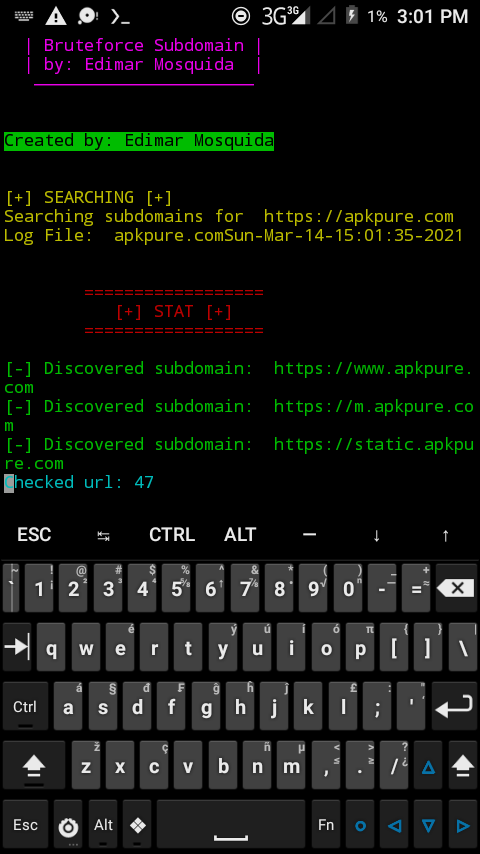

**BSDM** or **B**ruteforce**S**ub**D**o**M**ain is a simple and lighweight Subdomain Bruteforcing tool writen in Python 3.x

## INSTALATION
~# git clone [https://github.com/EdimarNotFound/BSDM](https://github.com/EdimarNotFound/BSDM)

~# pip install requests

~# python main.py

And fill the input needed!

*Note*
**for windows edit the os.system('clear') in main.py and change it with os.system('cls')**

## SCREENSHOT

**Have a good day**
